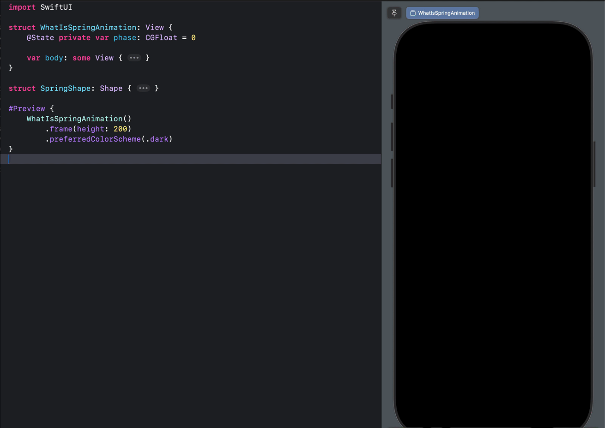
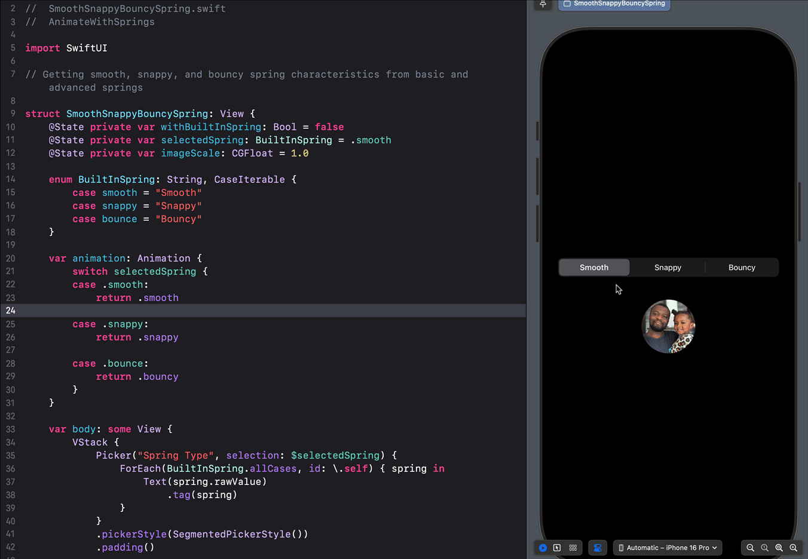

# SwiftUI Spring Animation Cheat Sheet for Developers

## The Meaning, Maths & Physics of iOS/SwiftUI Spring Animations


[SilentMode](https://github.com/GetStream/swiftui-spring-animations/tree/main/AnimateWithSprings/AnimateWithSprings/SpringExampleUseCases/SpringsUseCases/Animation/SilentMode)

Spring animation provides an excellent way for developers to add elegant and dynamic motion to their apps. This article and its companion repo focus on Spring Animation on iOS using SwiftUI. It serves as a Spring Animation cheat sheet and cookbook for building fine-grained and buttery motion/animations on iOS. However, developers can apply the core concepts to create fluid animations, motion, and transitions for platforms like React, Android, and Flutter.

As your 2025 New Year gift, the [Xcode project](https://github.com/GetStream/swiftui-spring-animations/tree/main/AnimateWithSprings) on [GitHub](https://github.com/GetStream/swiftui-spring-animations) includes many practical examples and use cases illustrating key spring animation concepts and parameters.


## Springs Overview

This post outlines my approach to creating fluid and organic animations/motion for [chat](https://getstream.io/chat/) and [audio/video](https://getstream.io/video/) using nothing but [springs](https://developer.apple.com/documentation/swiftui/spring) in SwiftUI. Get inspired by the techniques, tips, tricks, and hidden gems this post unlocks to add beautiful and useful animations to your apps powered by springs.


[WhatIsSpringAnimation.swift](https://github.com/GetStream/swiftui-spring-animations/blob/main/AnimateWithSprings/AnimateWithSprings/WhatIsSpringAnimation.swift)

Spring animation emulates the behavior of an object attached to a physical spring, as shown above, which helps you create an illusion of naturalness and believableness in the human eyes. It mimics the movement of soft objects and their properties in the physical world. Unlike animating with timing curves (e.g. `easeIn`, `easeOut`, `easeInOut`), springs can cause animations to begin and stop at different times to create smooth and imprecise movements using their initial velocity.

**What is Initial Velocity?**

The initial velocity of an object attached to a spring is the initial rate of change of a specific parameter you want to animate. Its purpose is to manage the spring animation's starting speed. The initial velocity is directly proportional to momentum. A higher value increases the initial momentum and overshoots the animation. It is helpful for human-initiated animations and gestural interactions involving drag, tap, and swipe.

**Illustrating Initial Velocity**

[InitialVelocity.swift](https://github.com/GetStream/swiftui-spring-animations/blob/main/AnimateWithSprings/AnimateWithSprings/NewSprings/SpringPrpperties/InitialVelocity.swift)


The example above gets the initial velocity from the tap gesture
Sometimes, when animation is still in progress, a new animation can change the value of the animation's target. When this situation occurs, the spring animation uses its speed during the retargeting phase as its initial velocity toward the new destination. The preview above demonstrates the speed of an animation in progress and the initial velocity of new retargeting positions. The interruptions from the incompleted animations make the entire animation look smooth and natural.

## Why Springs

[TransformAndShapeMorphing.swift](https://github.com/GetStream/swiftui-spring-animations/blob/main/AnimateWithSprings/AnimateWithSprings/SpringExampleUseCases/SpringsUseCases/Animation/TransformAndShapeMorphing.swift)


Across the Apple ecosystem, springs are the default animations for most interactions. For example, launching an app from its icon on iOS, tapping a list item to go to a detailed screen, and navigating from one screen to another have a smooth spring effect by default. To get a default spring animation for your views in SwiftUI, wrap the animation using `withAnimation` without specifying any customization.

```swift
withAnimation {
	isPlaying.toggle()
}
```

The following are some reasons why you may want to use spring animations in your apps.

They help to achieve continuous position and velocity, which prevents unnatural, sudden changes.
The smooth, snappy, and bouncy presets make animating with springs easy. These are default spring values used across iOS.

- **Fine-tuning**: The default presets `.smooth`, `.bouncy`, `.snappy` can be easily tuned for different use cases, such as when there is less `.bounce(duration: 1.0, extraBounce: 0.2)` or more `.bounce(duration: 1.0, extraBounce: 0.6)` bounce.
- **Customization**: Springs can be easily customized by specifying the duration and bounce values `.spring(duration: 0.6, bounce: 0.2)`.
  With springs, it is clear to see if the animation of an object is moving or stopping.
  It helps users understand the UI and what is happening and increases their enjoyment of interacting with it.
- **Natural feeling**: You can specify the initial velocity of your animation. For gestural interactions, the initial velocity can come from the gesture (for example, a drag gesture).
- **Animation continuity**: The only animation type maintains continuity for stationary cases and those with initial velocity.
- **Shape of motion**: There is no point in a spring curve where an animation completes suddenly. Springs can be both bouncy and non-bouncy. Non-bouncy springs can be seen on iOS during app launches, sheet presentations, and navigation links (push and pop).

## Real-World Applications of Spring Animations

Springs can be used in your apps for:

- **Transitions**: Move from one page to another using push and pop. [ScreenToScreenDefaultSpring.swift](https://github.com/GetStream/swiftui-spring-animations/blob/main/AnimateWithSprings/AnimateWithSprings/SpringExampleUseCases/SpringsUseCases/Transition/ScreenToScreenDefaultSpring.swift)


- **Gestures**: Use springs where a drag gesture is required to move an object from one point to another. [DragFromAToB.swift](https://github.com/GetStream/swiftui-spring-animations/blob/main/AnimateWithSprings/AnimateWithSprings/SpringExampleUseCases/SpringsUseCases/HumanInitiatedGesture/DragFromAToB.swift)


- **Animation**: You can use springs to make your views move, grow, and change size. [MultiStepSpring.swift](https://github.com/GetStream/swiftui-spring-animations/blob/main/AnimateWithSprings/AnimateWithSprings/SpringExampleUseCases/MultiStepSpring.swift)


## Traditional Ways of Specifying Springs: An Overview (iOS 16 and below)

To use spring animations in apps, we create a model that simulates an object attached to a spring in the physical world. The fundamental properties of the spring model consist of mass, stiffness, and damping. The above properties determine the type of spring motion that occurs and are used as the traditional way of specifying springs. You can customize the properties to build different animations. [CardView.swift](https://github.com/GetStream/swiftui-spring-animations/blob/main/AnimateWithSprings/AnimateWithSprings/SpringExampleUseCases/CardSwipe/CardView.swift)


This section introduces you to spring animations, specifically on iOS, and explains how best to use them in your apps. A spring in its basic form is defined by three properties: mass, stiffness, and damping.

- **Mass**: Think of mass as the weight of the animating object. It changes the inertia of the object attached to the spring. That is the willingness of an object to move or stop moving. It is conceptually heavier and can be used to create a spring animation that overshoots. The heavier the mass, the longer it takes to move the object, speed it up, and slow it down.
- **Stiffness**: It is the tensile strength of the spring. A higher stiffness will result in snappier animations. Stiffness affects the force applied to the object and changes how quickly it moves towards its target.
- **Damping**: You can think of damping as the braking of a car or the back-drag frictional force on the surface the object is resting on. Its purpose is to stop the object over time. It also affects the ability to overshoot the object. Hint: If you want to use a traditional spring in SwiftUI, start with a damping of 15 and a stiffness of 170. Reducing the damping, for example, to a value of 5 will create a spring animation with higher bounciness.

You can use the above fundamental spring properties to define your animations. However, they are not as intuitive as the [new springs](https://developer.apple.com/documentation/swiftui/spring) in iOS 17+. [SpringModeling.swift](https://github.com/GetStream/swiftui-spring-animations/blob/main/AnimateWithSprings/AnimateWithSprings/NewSprings/SpringModeling/SpringModeling.swift)


As seen above, the object's animation has continuous position and velocity. A spring animation is excellent for moving an object from a resting position to a destination.

Springs can begin with no or any amount of initial velocity and cause the animation to slowly and gradually come to a resting position. A spring animation can start with any initial velocity, making the animation feel natural. The timings of the spring animation don't line up perfectly. The misalignment of timing makes the animation feel natural to the eyes.

## When To Use Springs


[LikeAnimations](https://github.com/GetStream/swiftui-spring-animations/tree/main/AnimateWithSprings/AnimateWithSprings/SpringExampleUseCases/SpringCharacterAnimations/LikeAnimations)

Springs can be used in your apps for several cases, like the following.

- When an animation begins from a resting position.
- When you want a gesture accompanied by animation, like drag-and-drop.
- A situation whereby demonstrating initial velocity is necessary. `.linear` and `easeIn` use pre-specified curves, so there is no way to represent an initial velocity.
- When an animation requires a 2-dimensional movement. For example, dragging a ball from A to B to C and back to A in a triangular form. [DragFromAToB.swift](https://github.com/GetStream/swiftui-spring-animations/blob/main/AnimateWithSprings/AnimateWithSprings/SpringExampleUseCases/SpringsUseCases/HumanInitiatedGesture/DragFromAToB.swift)


## Understanding Duration


Technically, a spring animation oscillates forever. To remove the animation, you should set a time interval. We call the time for the spring animation to be complete enough to be removed a **settling duration**. The settling duration differs from the perceptual duration of the spring and may depend on several factors.

In contrast to the predictability of the spring's perceptual duration, the settling duration remains unpredictable. In spring animations for iOS 16 and below, the motion of the springs decays with a settling duration. iOS 17 introduces a **perceptual duration** parameter `.bounce(duration: 1.0, extraBounce: 0.6)`, which, when set, causes a gradual feeling of coming to rest towards the target.

Advanced properties of an unrefined spring include:


- **Response**: It controls how quickly an animating property value will try to get to a target. You can use the response to create an infinitely-stiff spring by setting its value to zero.
- **Damping Fraction**: Damping fraction causes a gradual reduction in the spring's oscillation. Using damping fraction, you can define how rapidly the oscillations decay from one bounce to the next. Additionally, you can damp the spring in the following ways:
- **Blend Duration**: Blend duration is when a previous animation stops and the following animation starts. Changing the blend duration of any examples in this repository produces no visual change. This makes it difficult to see what it does.

Springs that use mass, stiffness, and damping do not depend on time. The absence of duration makes working with these springs difficult because their motion is unpredictable. The following sections will introduce you to a new way to specify your spring animations in SwiftUI.

## A New Way To Specify Springs: Built-in Springs Overview



[SmoothSnappyBouncySpring.swift](https://github.com/GetStream/swiftui-spring-animations/blob/main/AnimateWithSprings/AnimateWithSprings/NewSprings/SmoothSnappyBouncySpring.swift)

iOS 17 invented a new way of defining spring specifications with **duration** and **bounce**. This specification defines a perceived duration and how bouncy an animation can be. The refined built-in springs help to create spring animations based on duration (time interval) and bounce. Increasing the duration makes the animation last longer, whereas increasing the bounce increases the springiness of the animation. Apple has adopted the new spring animation as the default on most platforms and apps.

```swift
​​withAnimation(.spring(duration: 0.6, bounce: 0.2)) {
  // Changes
}
```

- `duration`: The animation lasts shorter or longer depending on your specified value.
- `bounce`: Sets the springiness of the animation.

For example, adding:

`withAnimation { }` with an unspecified parameter gives the same result as `withAnimation(.smooth) { }`.

## Using Built-in Spring Presets (iOS 17+)


[SpringPresets.swift](https://github.com/GetStream/swiftui-spring-animations/blob/main/AnimateWithSprings/AnimateWithSprings/NewSprings/SpringPresets/SpringPresets.swift)

From iOS 17, you can add three built-in spring presets such as `.smooth`,`.snappy`, and `.bouncy` to your SwiftUI views. These presets have predefined duration and bounce values that can be fine-tuned.

- `.smooth`: A smooth spring has a predefined duration. However, it does not have a bounce value `smooth(duration: TimeInterval = 0.5, extraBounce: Double = 0.0)`.
- `.snappy`: A snappy spring has a predefined duration and a small amount of bounce `snappy(duration: TimeInterval = 0.5, extraBounce: Double = 0.0)`.
- `.bouncy`: It has a predefined duration and a large bounce. `bouncy(duration: TimeInterval = 0.5, extraBounce: Double = 0.0)`.

From the preview above, all the examples look identical. However, reducing the playback speed will show a slight difference. Check out the **SpringPresets** folder of the Xcode project to see examples of each preset.

```swift
import SwiftUI

enum SmoothPhases {
    case start, middle, end
}

struct SmoothPreset: View {
    var body: some View {
        Rectangle()
            .fill(.blue.gradient)
            .frame(width: 200, height: 200)
            .phaseAnimator([SmoothPhases.start, .middle, .end], content: { view, smooth in
                view
                    .cornerRadius(smooth == .start ? 0 :
                                    smooth == .middle ? 32 : 100)
                    .rotationEffect(.degrees(smooth == .middle ? 180 : 0))
            }, animation: { smooth in
                switch smooth {
                case .start: return .smooth
                case .middle: return .smooth
                case .end: return .smooth
                }
            })
    }
}
```

These presets above provide excellent ways to experiment with springs if you need help figuring out where to start.

A bouncy spring has `bounce > 0%`. Use a large bounce, for example `0.4` to create playful animations

```swift
withAnimation(.bouncy) {
// Changes
}

```


[Like animations](https://github.com/GetStream/swiftui-spring-animations/tree/main/AnimateWithSprings/AnimateWithSprings/SpringExampleUseCases/SpringCharacterAnimations/LikeAnimations)

## Customizing Built-in Spring Characteristics (iOS 17+)


[SpringPresetWithCustomDuration.swift](https://github.com/GetStream/swiftui-spring-animations/blob/main/AnimateWithSprings/AnimateWithSprings/NewSprings/SpringPresets/SpringPresetWithCustomDuration.swift)

The spring presets in iOS 17 support fine-tuning to create customized versions. For example, we can give a snappy, smooth, or bouncy spring a different duration or bounce value. The code snippet below demonstrates springs with a custom duration.

```swift
import SwiftUI

enum DurationPhases {
    case start, middle, end
}

struct SpringPresetWithCustomDuration: View {
    var body: some View {
        Rectangle()
            .fill(.blue.gradient)
            .frame(width: 200, height: 200)
            .phaseAnimator([DurationPhases.start, .middle, .end], content: { view, morthRotate in
                view
                    .cornerRadius(morthRotate == .start ? 0 :
                                    morthRotate == .middle ? 32 : 100)
                    .rotationEffect(.degrees(morthRotate == .middle ? 180 : 0))
            }, animation: { morthRotate in
                switch morthRotate {
                case .start: return .snappy(duration: 1.0)
                case .middle: return .smooth(duration: 1.0)
                case .end: return .bouncy(duration: 1.0)
                }
            })
    }
}
```

Refer to `SpringPresetWithCustomBounce.swift` in the [Xcode project](https://github.com/GetStream/swiftui-spring-animations/tree/main/AnimateWithSprings/AnimateWithSprings/NewSprings/SpringPresets) for an example that adds a custom bounce value.

### Getting a Bouncy Spring (Underdamped): `bounce > 0`


[UseCustomSpring.swift)](https://github.com/GetStream/swiftui-spring-animations/blob/main/AnimateWithSprings/AnimateWithSprings/CreateCustomSpring/UseCustomSpring.swift)

A bouncy spring (bounce > 0) overshoots its target. In physics, this is called an underdamped spring. Changing the bounce value to 50% generates a bouncy spring. A 100% bounce value produces a cosine wave, oscillating the spring back and forth. Using the bounce value of 100% means the spring has no frictional force acting on it. The animation neither slows down nor reaches its final state. Decreasing the bounce value (`bounce = 0.5`) causes friction (damping) to act on the spring and slows the object attached to the spring.

**Getting a Large Bounce**: `bounce = 0.3`


A bounce value `>= 0.3` results in a larger overshoot. You can use this kind of spring to build exaggerated animations.

```swift
import SwiftUI

enum LargeBouncePhases {
    case start, middle, end
}

struct SpringWithLargeBounce: View {
    var body: some View {
        Rectangle()
            .fill(.blue.gradient)
            .frame(width: 200, height: 200)
            .phaseAnimator([LargeBouncePhases.start, .middle, .end], content: { view, morthRotate in
                view
                    .cornerRadius(morthRotate == .start ? 0 :
                                    morthRotate == .middle ? 32 : 100)
                    .rotationEffect(.degrees(morthRotate == .middle ? 180 : 0))
            }, animation: { morthRotate in
                switch morthRotate {
                case .start: return .spring(duration: 0.5, bounce: 0.3)
                case .middle: return .spring(duration: 0.5, bounce: 0.3)
                case .end: return .spring(duration: 0.5, bounce: 0.3)
                }
            })
    }
}
```

**Getting a Small Bounce**: `bounce = 0.15`


A small bounce value of about 15% creates a spring effect that feels brisk and not bouncy.

```swift
import SwiftUI

enum SmallBouncePhases {
    case start, middle, end
}

struct SpringWithSmallBounce: View {
    var body: some View {
        Rectangle()
            .fill(.blue.gradient)
            .frame(width: 200, height: 200)
            .phaseAnimator([SmallBouncePhases.start, .middle, .end], content: { view, morthRotate in
                view
                    .cornerRadius(morthRotate == .start ? 0 :
                                    morthRotate == .middle ? 32 : 100)
                    .rotationEffect(.degrees(morthRotate == .middle ? 180 : 0))
            }, animation: { morthRotate in
                switch morthRotate {
                case .start: return .spring(duration: 0.5, bounce: 0.15)
                case .middle: return .spring(duration: 0.5, bounce: 0.15)
                case .end: return .spring(duration: 0.5, bounce: 0.15)
                }
            })
    }
}
```

**Practical Examples of Bouncy Springs**

A bouncy spring has several use cases. You can, for example, use it to:

- Mimic a playful character. [SpringyDuoGetStarted.swift](https://github.com/GetStream/swiftui-spring-animations/blob/main/AnimateWithSprings/AnimateWithSprings/SpringExampleUseCases/SpringCharacterAnimations/DuolingoAnimation/SpringyDuoGetStarted.swift)


- Portray as a followthrough effect. [FollowThrough.swift](https://github.com/GetStream/swiftui-spring-animations/blob/main/AnimateWithSprings/AnimateWithSprings/SpringExampleUseCases/SpringsUseCases/HumanInitiatedGesture/FollowThrough.swift).


- Demonstrate the progress of an activity. [ProceedWithTouchID.swift](https://github.com/GetStream/swiftui-spring-animations/blob/main/AnimateWithSprings/AnimateWithSprings/SpringExampleUseCases/ProceedWithTouchID.swift)


- Confirm the completion of an activity. [ActivityProgressAnimation.swift](https://github.com/GetStream/swiftui-spring-animations/blob/main/AnimateWithSprings/AnimateWithSprings/SpringExampleUseCases/ActivityProgressAnimation/ActivityProgressAnimation.swift)


### Getting a Smooth Spring (Critically damped): `bounce = 0`


A no-bounce or general-purpose spring with `bounce = 0` creates a gradual change and smooth curve. This spring animation curve is called a critically damped spring. Setting the bounce value to `0%` removes all the oscillations in the spring, turning the curve into a rectilinear towards the target.

```swift
import SwiftUI

enum NoBouncePhases {
    case start, middle, end
}

struct SpringWithNoBounce: View {
    var body: some View {
        Rectangle()
            .fill(.blue.gradient)
            .frame(width: 200, height: 200)
            .phaseAnimator([NoBouncePhases.start, .middle, .end], content: { view, morthRotate in
                view
                    .cornerRadius(morthRotate == .start ? 0 :
                                    morthRotate == .middle ? 32 : 100)
                    .rotationEffect(.degrees(morthRotate == .middle ? 180 : 0))
            }, animation: { morthRotate in
                switch morthRotate {
                case .start: return .spring(duration: 0.5)
                case .middle: return .spring(duration: 0.5)
                case .end: return .spring(duration: 0.5)
                }
            })
    }
}
```

### Practical Examples of Non-bouncy Springs

On iOS, you can find non-bouncy springs across many places, including the following.

**Built-in Non-bouncy Spring Effects on iOS**

- **Settings App**: Slide-in and slide-out effects. SwiftUI uses the same non-bouncy spring effect when you wrap a view in a `NavigationLink` to transition from one screen to another. You can also use springs to create a sliding effect like the one below.

[CustomSlideInOut.swift](https://github.com/GetStream/swiftui-spring-animations/blob/main/AnimateWithSprings/AnimateWithSprings/NewSprings/Non-BouncySpring/CustomSlideInOut.swift)


- **Sheet presentation and dismissal**: SwiftUI's sheet presentation displays and dismisses content with a non-bouncy spring without you specifying that. [SheetPresentationDismissal.swift](https://github.com/GetStream/swiftui-spring-animations/blob/main/AnimateWithSprings/AnimateWithSprings/NewSprings/Non-BouncySpring/SheetPresentationDismissal.swift)


- **Slide to reveal the Control Center**: Sliding from the edge of your device's screen shows the Control Center items with a default non-bouncy spring effect. Flicking further vertically on the Control Center screen displays the hidden content with a non-bouncy spring.
- **The throwing animation of an app icon**: When you launch an app icon on iOS, a non-bouncy spring animation is used. When you flick it to rest, you experience the same spring feel.


### Todo: Getting a Flatter Spring (Overdamped): `bounce < 0`

A spring with a negative bounce value (`bounce < 0`) creates a flatter spring animation than when `bounce = 0`. The resulting Physics spring curve is called an overdamped spring.

**Practical Examples of Flatter Springs**
Create a serious effect

### To-do: Defining a Spring Without Friction

The bounce value must be 100% to create a spring animation with no friction, creating a cosine wave. The formation of a cosine curve/wave makes the spring oscillate forever.

## To-do: Going Further: Creating Custom Springs `.spring()`

You can specify the bounce and duration when using this spring type. The bounce has a range of `-1.0 to 1.0`.

``swift
withAnimation(.spring(duration: 0.6, bounce: 0.2)) { // Changes }

````

## To-do: Creating Custom Springs


You can create a custom spring animation by specifying the perceptual duration and bounce values.


## To-do: Using SwiftUI’s Spring Model Type


Aside from the ability to customize the built-in springs in iOS 17, SwiftUI allows modeling unrefined Spring(mass, stiffness, damping) with duration and bounce. The spring model type allows the creation of a representation of spring based on existing parameters (mass, stiffness, damping), which can be used directly as a parameter of `.spring()`.  For example, you can model a spring as:

```swift
let mySpring = Spring(duration: 0.5, bounce: 0.2)
let (mass, stiffness, damping) = (mySpring.mass, mySpring.stiffness, mySpring.damping)

let otherSpring = Spring(mass: 1, stiffness: 100, damping: 10) withAnimation(.spring(otherSpring)) { // Changes }
````

## To-do: Converting Springs: Calculate Damping and Stiffness

With a given mass, bounce, and duration, you can easily calculate the damping and stiffness of the spring using the following formulas.

When working with a spring model type, you can convert the duration and bounce values to stiffness and damping, giving a mass of 1.0 and using the following formulas.

```swift
mass = 1

stiffness = (2π ÷ duration)^2

damping = 1 - 4π × bounce ÷ duration, bounce ≥ 0
                  4π ÷ (duration + 4π × bounce), bounce < 0
```

## To-do: Build Advanced Spring Behaviors

You can call built-in spring methods such as `value` and `velocity` to model your own advanced spring behaviors. These methods are useful for building simulations and getting values for charts.

`value`: To obtain the position of the spring, call the value parameter.
`target`: The target you want the object (spring) to move towards.
`time`: The time you want to evaluate the spring at.
`velocity`: Velocity of the object over time.

## To-do: Spring Animation Best Practices

Springs can be very annoying when not used in the right way or for the appropriate purpose.

When unsure of the exact value, always start with `bounce = 0`. Then, increment it gradually to fine-tune the animation and obtain the required bounciness.
A bounce value of about 0.3 creates a noticeable springiness. Setting the `bounce > 0.4 ' creates extreme bounciness. Be cautious of such values because they may create exaggerated effects for UI animations.  
Define the character of the animation. Should it be serious, relaxed, playful, or fast-paced?
Springs do not always need to be bouncy. You should use bounciness appropriately.

## To-do: Where To Go From Here
